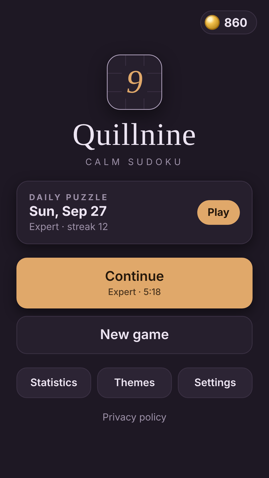
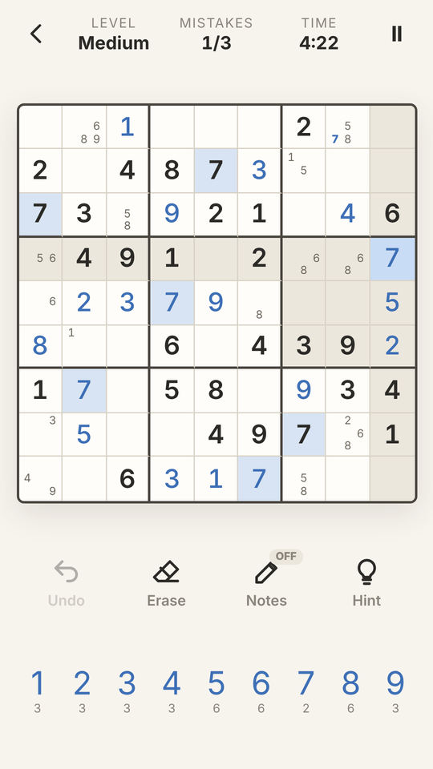
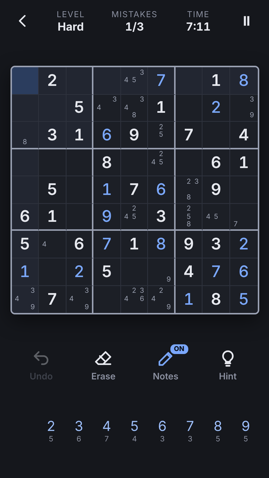
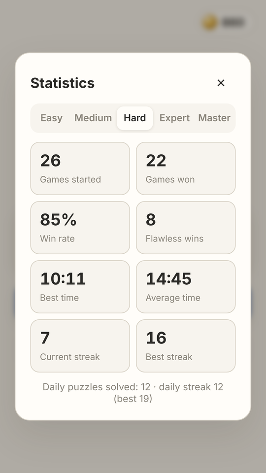

# 9 Quillnine: Calm Sudoku

A calm, **offline sudoku** with its own puzzle generator. Every puzzle has **exactly one solution** and is **graded by the solving techniques it needs**, from Easy to Master. There's a new **daily puzzle** every day, generated on the device from the date. It's written in vanilla HTML/CSS/JavaScript with no framework, and ships as an **Android app** (Capacitor 8 + Google AdMob) that **GitHub Actions** builds and signs automatically.

**▶ Play the live demo:** https://offerpk.github.io/sudoku/
**Privacy policy:** https://offerpk.github.io/sudoku/privacy.html
**Android downloads (signed AAB/APK):** [Releases](https://github.com/OfferPk/sudoku/releases)

<p align="center">
  
  
  
  
</p>

## How to play

- Fill the 9×9 grid so every **row, column and 3×3 box** contains the digits 1–9 once.
- Tap a cell, then a number. Turn on **Notes** to pencil in candidates. Placing a digit **removes that digit from the notes** in its row, column and box (you can turn this off).
- The selected cell's **row, column and box** are shaded, and **every copy of the same number** is highlighted, including in notes. The number pad shows how many of each digit are left.
- **Undo** reverts any move (including auto-removed notes). **Erase** clears a cell.
- **Mistakes:** with the **3-mistake limit** on, wrong entries are marked and the third one ends the game. Turn the limit off to play freely, with or without **auto-check** (marking wrong entries in red).
- **Hint** (▶ rewarded ad, **only when you tap it**): fixes a wrong entry if there is one, otherwise places the next logical digit and tells you the technique (e.g. "Hidden single"). **Extra mistake & continue** (▶ rewarded ad, once per puzzle) appears on the "Game over" screen.
- The **timer** pauses with the pause button (the board is hidden while paused) and automatically when the app goes to the background. The game **auto-saves after every move** and resumes where you left off.
- Solving puzzles earns **coins** (5–30, by difficulty) that unlock cosmetic **themes**. Coins can't be bought, cashed out or used for anything else. There are no purchases.

## Features

- **Generator with a uniqueness check.** A seeded random full grid is dug out cell by cell (with a symmetric pattern where possible), and a clue is only removed if a bitmask backtracking solver still finds **exactly one solution**.
- **Difficulty graded by technique.** A human-style logical solver (`grade()` in `www/js/logic.js`) rates each puzzle by the hardest tier it needs:
  - **Easy:** hidden singles only (36–39 givens)
  - **Medium:** + naked singles
  - **Hard:** + locked candidates (pointing / claiming), naked and hidden pairs
  - **Expert:** + naked/hidden triples and quads, X-Wing, Swordfish, Jellyfish, XY-Wing, XYZ-Wing
  - **Master:** needs forcing chains (contradiction testing) beyond all of the above
  Puzzles are regenerated until the grade matches the requested difficulty exactly.
- **Daily puzzle.** Seeded by the local date (`hashString('quillnine-daily-YYYY-MM-DD')`), so it's the same for everyone on that day, fully offline. Difficulty follows the week (Mon Easy → Sat/Sun Expert). It keeps a daily streak.
- **Stats per difficulty:** games started/won, win rate, best and average time, flawless wins (no mistakes, no hints), current and best win streak, plus daily puzzles solved and the daily streak.
- **4 themes:** Paper and Midnight (dark) are free; Sage and Dusk (dark) are unlocked with coins.
- A clean, calm, adult look: soft paper and ink colours, serif title, gentle animations, **WebAudio** synthesized sounds (no audio files) and light **haptics** via `@capacitor/haptics`. Keyboard support (1–9, arrows, N, Backspace, Ctrl+Z) on the web.
- No build step: open `www/index.html` or serve the folder.

## Project layout

```
www/                  ← the whole game (also the Capacitor webDir & the Pages site)
  index.html, css/style.css, privacy.html, icon.png
  js/logic.js         ← pure rules: validation, solver, uniqueness, generator, grader, daily seed, notes
  js/game.js          ← DOM board, input, notes, undo, timer, persistence, stats, shop, settings
  js/sound.js         ← WebAudio SFX
  js/themes.js        ← cosmetic theme catalog
  js/ads-config.js    ← ★ ALL AdMob IDs + pacing numbers live here
  js/adgate.js        ← interstitial pacing rules (pure, unit-tested)
  js/ads.js           ← UMP consent, banner, interstitial, rewarded
android/              ← Capacitor Android project (committed)
assets/               ← icon/splash generator (make_icon.py) + 512 px store icon
store/                ← Google Play listing kit (graphics, text, answers, checklist, capture scripts)
test/                 ← logic + ad-gate tests (Node) and a headless-Chrome play test
.github/workflows/    ← android.yml (signed AAB/APK + Releases), pages.yml (web demo)
```

## Run locally

```bash
npm install
npm run serve          # http://localhost:8080
npm test               # 200 unique puzzles per difficulty, solver/grader, validation, notes, daily seed, ad pacing
PUZZLES_PER_DIFFICULTY=50 node test/logic.test.js   # quicker run
```

Headless phone-size play test (plays a puzzle with taps: notes and auto-remove, highlights, undo/erase, mistakes and the limit, extra mistake, hint, pause, solve, stats, daily, themes, reload/resume, and fails on any console error):

```bash
npm i --no-save puppeteer-core
PUPPETEER=puppeteer-core node test/browser.test.js http://localhost:8080/ /tmp   # Chrome at /usr/bin/google-chrome (or CHROME=...)
```

## Ads (AdMob) and the ad rules

| Hook | When | In a browser |
|---|---|---|
| `Ads.init()` | on launch: **UMP consent** + SDK init only, **no ad is shown** | no-op |
| `Ads.showBanner()` | only while the **gameplay screen** is open (adaptive banner at the bottom) | no-op |
| `Ads.maybeInterstitial(gate)` | only when leaving the **Puzzle solved** screen (**New game** or **Home**), when `AdGate` allows it | never |
| `Ads.showRewarded(cb)` | only when the player taps **Hint** or **Extra mistake & continue**. The reward is granted only on the SDK's *earned reward* event | grants the reward immediately |

Interstitial pacing, enforced in `www/js/adgate.js` and tested in `test/adgate.test.js`:

- **None** until the player has solved **5 puzzles** *and* played for **3 minutes** in total (timer running).
- After that, at most **one every 3 solved puzzles** and at most **one per 90 s**, only on the puzzle-complete transition. If an ad isn't ready, the game simply continues.
- **Never** on launch, exit, back press or mid-puzzle. There are no app-open ads, and the pacing state is saved so restarting the app doesn't reset it.

### Swapping in your real AdMob IDs

The repo uses **Google's official test IDs**. Change them in exactly **two** places:

1. **`www/js/ads-config.js`**: set `APP_ID`, `BANNER_ID`, `INTERSTITIAL_ID` and `REWARDED_ID`, then set `IS_TESTING: false`.
2. **`android/app/src/main/AndroidManifest.xml`**: set the `com.google.android.gms.ads.APPLICATION_ID` meta-data value to your real **App ID** (`ca-app-pub-XXXX~YYYY`).

Then bump the version, commit and tag. CI builds a new signed AAB. In AdMob, also publish a **Privacy & messaging → GDPR message** so the consent form appears, and add an `app-ads.txt` to your developer website.

## Android build

- Capacitor 8, appId **`com.offerpk.sudoku`**, name **Quillnine**, plugins `@capacitor-community/admob` 8.1.0 and `@capacitor/haptics` 8.
- `compileSdk`/`targetSdk` **36**, `minSdk` **24**, versionCode **1**, versionName **1.0.0** (in `android/app/build.gradle` / `android/variables.gradle`).
- Permissions: `INTERNET`, `ACCESS_NETWORK_STATE`, `AD_ID` (AdMob) and `VIBRATE` (haptics). No billing: the game has no purchases.

### CI (GitHub Actions)

`.github/workflows/android.yml` runs on every push to `main`, on `v*` tags, and on manual dispatch: Node 22 + JDK 21 → `npm ci` → `npm test` → `npx cap sync android` → `./gradlew bundleRelease assembleRelease` → it prints the APK's `targetSdkVersion` with `aapt2` and verifies the signatures. The signed **`.aab`** and **`.apk`** are uploaded as artifacts, and a `v*` tag also creates a **GitHub Release** with both files attached. `pages.yml` deploys `www/` to GitHub Pages.

Signing uses these repository secrets (the keystore and passwords are **never** committed):

| Secret | Contents |
|---|---|
| `KEYSTORE_BASE64` | `base64 -w0 upload.jks` |
| `KEYSTORE_PASSWORD` | keystore password |
| `KEY_ALIAS` | key alias (`upload`) |
| `KEY_PASSWORD` | key password |

### Build locally

```bash
npm ci
npx cap sync android
cd android
ANDROID_KEYSTORE_FILE=/path/upload.jks KEYSTORE_PASSWORD=... KEY_ALIAS=upload KEY_PASSWORD=... \
  ./gradlew bundleRelease assembleRelease
```

### Icons and splash

`python3 assets/make_icon.py` regenerates the original launcher icons (legacy, round and adaptive foreground), the splash screens, `www/icon.png` and the 512 px store icons.

## Releasing to Google Play

See **[`store/LAUNCH-CHECKLIST.md`](store/LAUNCH-CHECKLIST.md)** (it opens with a Roman Urdu summary), [`store/listing-en.md`](store/listing-en.md) and [`store/play-console-answers.md`](store/play-console-answers.md).

1. Bump `versionCode` (+1 every upload) and `versionName`, and switch to your real AdMob IDs.
2. `git tag v1.0.1 && git push origin v1.0.1`. CI attaches `sudoku-v1.0.1.aab` and `.apk` to a Release.
3. Upload the `.aab` in Play Console with **Play App Signing** turned on. The CI keystore is your **upload key**.

## License

[MIT](LICENSE) © 2026 OfferPk. See also the [Privacy Policy](PRIVACY.md).
